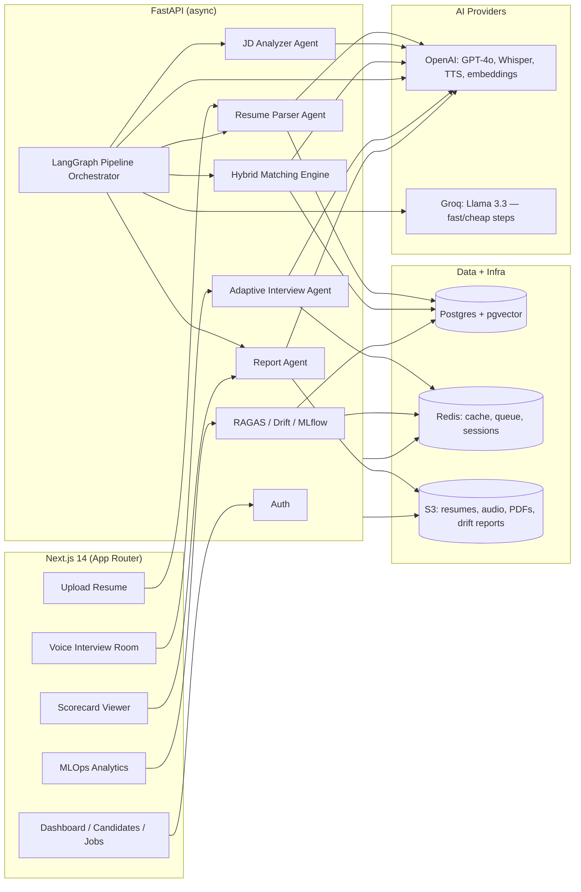

# Smart Hiring Platform

An AI-native hiring platform: upload a resume, post a job, get ranked matches, run an AI voice interview, and get a structured feedback report — with a recruiter dashboard, MLOps evaluation/monitoring, and JWT auth wrapping all of it.

Built incrementally as 8 modules, each with its own detailed write-up (in Hinglish) linked below. This README is the map of the whole thing.

## What it does

1. **Upload a resume** (PDF/DOCX) → an LLM extracts structured data (skills, experience, education) and generates an embedding.
2. **Post a job description** → an LLM extracts requirements (skills, seniority, responsibilities) and generates an embedding.
3. **Match candidates to jobs** via hybrid search — dense (pgvector) + sparse (BM25) + reciprocal rank fusion + cross-encoder reranking — with LLM-generated explanations.
4. **Run the full hiring pipeline** as a LangGraph state machine (parse → analyze → match → generate interview questions → generate a report), streamed live over SSE, with cost-aware dual-LLM routing (Groq for cheap/fast steps, GPT-4o for the rest).
5. **Interview candidates with a real-time AI voice agent** — adaptive follow-up questions, Whisper STT, OpenAI TTS, WebRTC VAD-based turn-taking over a WebSocket.
6. **Generate a candidate scorecard**: a structured GPT-4o report (few-shot calibrated) rendered as a PDF with charts, viewable as a donut/radar-chart web page, shareable by email.
7. **Evaluate and monitor the system itself**: RAGAS scoring of the retrieval+generation flow, embedding-drift detection (PSI), MLflow experiment tracking, Prometheus metrics, Redis caching.
8. **Run it as a real product**: recruiter accounts (JWT auth with refresh-token rotation), a dashboard (stats, activity feed, candidate table with filters and bulk actions, job board), Slack/email notifications, and deployment configs (Docker, nginx, GitHub Actions → ECR/ECS).

## Architecture



## Module map

| # | Module | What it added |
|---|--------|----------------|
| 1 | [Project Setup](MODULE_1_SETUP.md) | FastAPI + Next.js scaffold, Postgres/pgvector, Redis, Docker Compose |
| 2 | [Resume Parser Agent](MODULE_2_SETUP.md) | PDF/DOCX upload → LLM structured extraction → embeddings |
| 3 | [JD Analyzer + Matching Engine](MODULE_3_SETUP.md) | Hybrid search (dense + BM25 + RRF + cross-encoder reranking) |
| 4 | [LangGraph Orchestrator + LLM Router](MODULE_4_SETUP.md) | Full pipeline as a state machine, dual-LLM cost routing, SSE streaming |
| 5 | [AI Interview Engine](MODULE_5_SETUP.md) | Adaptive voice interview: LangGraph Q&A, Whisper, TTS, WebRTC VAD, WebSocket |
| 6 | [Feedback Report + PDF Scorecard](MODULE_6_SETUP.md) | Few-shot calibrated GPT-4o report, PDF generation, donut/radar chart UI |
| 7 | [MLOps + RAG Evaluation](MODULE_7_SETUP.md) | RAGAS eval, PSI drift detection, MLflow tracking, Prometheus, Redis caching |
| 8 | [Recruiter Dashboard + Auth](MODULE_8_SETUP.md) | JWT auth, notifications, dashboard/candidates/jobs UI, deployment configs |

Each doc explains what was built, *why* specific design decisions were made (including real deviations from the original spec and the reasoning behind them), and — importantly — what was actually verified against real services (no mocks) versus what's documented as unverified.

## Tech stack

**Backend** — FastAPI (async), SQLAlchemy 2.0 (async), PostgreSQL + pgvector, Redis, Alembic, LangChain + LangGraph, OpenAI SDK, Groq SDK, boto3 (S3), RAGAS, MLflow, prometheus-client, reportlab + matplotlib, python-jose + bcrypt, SendGrid, webrtcvad.

**Frontend** — Next.js 14 (App Router), TypeScript, Tailwind CSS, a small shadcn-style component library, TanStack React Query, Zustand, NextAuth.js, Recharts, react-dropzone, axios.

**Infra** — Docker / Docker Compose, nginx (reverse proxy), GitHub Actions (test → build → push to ECR → deploy to ECS).

## Project structure

```
smart-hiring/
├── backend/
│   ├── app/
│   │   ├── agents/          # LangGraph agents: resume parser, JD analyzer, orchestrator,
│   │   │                    #   interview agent, question generator, report agent
│   │   ├── api/v1/routes/   # auth, resume, jobs, matching, pipeline, interview, report,
│   │   │                    #   analytics, candidates, dashboard, notifications
│   │   ├── core/            # config, database, redis, security (JWT/bcrypt), cache, deps
│   │   ├── models/          # SQLAlchemy models (candidate, job, interview, report, mlops, recruiter)
│   │   ├── schemas/         # Pydantic request/response schemas
│   │   └── services/        # embeddings, S3, matching, LLM routing, voice, PDF, email,
│   │       └── mlops/       #   Slack, notification queue, monitoring
│   │                        #   RAGAS evaluator, drift detector, experiment tracker
│   └── alembic/versions/    # DB migrations
├── frontend/
│   ├── app/                 # upload, jobs, interview, report, analytics, dashboard,
│   │                        #   candidates, (auth)/login — Next.js App Router
│   ├── components/          # ui/ (design system) + layout/ (sidebar, header, breadcrumbs)
│   ├── lib/                 # api client, auth config, cache/pcm helpers, zustand stores
│   └── types/                # TypeScript types mirroring backend schemas
├── deploy/                  # nginx.conf, ECS task definitions
├── .github/workflows/       # CI/CD pipeline
└── docker-compose.yml
```

## Getting started

### Prerequisites

- Python 3.12, Node 20
- Docker (for Postgres/Redis, or run the whole stack via Compose)
- API keys: OpenAI, Groq, AWS (S3). Optional: SendGrid, Slack webhook.

### 1. Backend

```bash
cd backend
python -m venv .venv && .venv/Scripts/activate   # or source .venv/bin/activate
pip install -r requirements.txt
cp .env.example .env   # fill in DATABASE_URL, API keys, JWT_SECRET_KEY, etc.
uvicorn app.main:app --reload
```

API docs: `http://localhost:8000/docs` · Health check: `http://localhost:8000/health`

### 2. Frontend

```bash
cd frontend
npm install
cp .env.local.example .env.local   # NEXTAUTH_SECRET especially
npm run dev
```

App: `http://localhost:3000` → register a recruiter account at `/login`, then explore `/dashboard`, `/candidates`, `/jobs`, `/upload`, `/analytics`.

### 3. Or run everything with Docker Compose

```bash
docker compose up --build
```

Brings up Postgres (with pgvector), Redis, backend, and frontend together.

## Known gaps

Written up honestly rather than glossed over — see the module docs for the full reasoning behind each:

- **No automated test suite yet.** Every module here was verified through real, live smoke testing against actual services (not mocks) during development, but there's no committed pytest suite — CI currently runs import/type/lint checks instead.
- **AWS deployment (ECR/ECS) is unverified.** The GitHub Actions workflow and ECS task definitions follow standard patterns and are syntax-validated, but there's no AWS account/cluster in this environment to deploy to. The Docker builds and containers, however, *are* verified — both images build and the backend container was run and health-checked against real Postgres/Redis.
- **Evidently AI was deliberately not used** for drift detection (Module 7) — it has a real, verified dependency conflict that breaks file uploads. PSI is implemented directly instead.
- **Existing candidate-facing flows (upload, interview) aren't behind recruiter auth** — only genuinely recruiter-only actions (dashboard, bulk actions, notifications) are protected, by design.

## License

Not yet specified.
